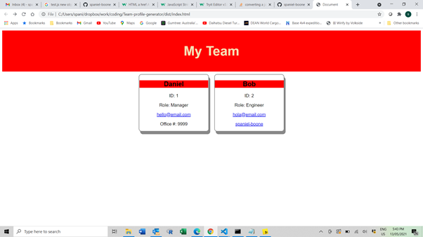

# Team-profile-generator
A simple team profile generator that allows a user to generate a basic html team profile page using interactive console inputs

## Author
github.com/spaniel-boone

## Description
This application has been developed as a learning tool to understand the usage of node modules in web applications. It has been built 'from scratch' with the aim of implementing capability that allows dynamic updating of a team-profile page. 

In this case I sought to go a little beyond the original outline of the task. The outline required only up to three entries, one of each for a 'manager', an 'engineer', and an 'intern' (in that order). I have, instead, allowed the user to enter details of any worker in any order, and for any number of workers. My implementation also allows updating of the team-profile page after publication by maintaining the existing index.html file and simply updating it with more profile 'cards'. The html and css have been designed to be easily modified by UX specialists. 

Key learnings from this project were:
    - Installation, usage, and use-cases of Node and npm, implementation of unit testing approaches, and using promises within indefinite loops. 

Future additions: the main limitation currently is the lack of ability to delete existing profiles from the console. This would require implementation of an HTML id value in each new profile card that could then be entered by users for deletion. 

## Table of Contents
- [Installation](#installation)
- [Usage](#usage)
- [Tests](#tests)
- [Features](#features)

## Installation
- You must have Node installed on your computer. See here https://nodejs.org/en/download/. 
- Check that you have the latest version of npm installed. In node type this into the console: 'npm install npm@latest -g'
- Ensure you have the following npm modules installed:
    * fs
    * node-html-parser
    * inquirer
    * jest (if you wish to run the tests)

- Run the program!
    * Navigate to your root directory for the app
    * Type 'node index.js' into the console
    * Answer the prompts!

## Usage
See the link below for a video presenting usage of the Team-profile-generator program
https://drive.google.com/file/d/1ahrbbt1Vv7LMMf5t5UY_6n0tUGJoZbZ2/view

The team-profile-generator creates a simple team-profile page ready for further design tweaks in your favourite CSS framework. It has been developed using semantic HTML with a regular class and ID structure, and use of flexbox layouts to facilitate straight-forward styling. The raw layout with two employees is shown below:

A useful feature of the team-profile-generator is that users can add more employees to an existing profile page simply by running the script again. Below we show a new employee has been added to the original team profile page. 

## Tests
The application includes a battery of tests that can be run by users from the root folder. 

To run the tests navigate to the root folder and run 'npm run test' in the console. You must have jest installed as outlined above. 

## Features
The program features an indefinite loop through a series of questions that provide core information on a set of three different employees:
1. Managers
2. Engineers
3. Interns

The user can exit the program after entering any number of employees with the html being dynamically updated for each new entry. This is implemented using a 'while' loop. At the end of each new employee entry the user can select to add another employee or to exit. This approach provides greater flexibility to the user. 

The program updates an existing Index.html file allowing updating of the profile page with additional employees easily. 
